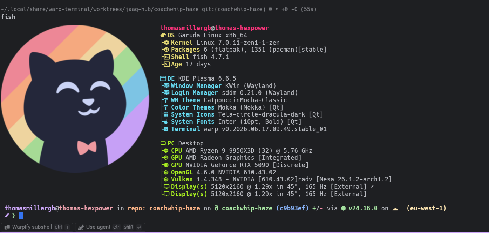

# Warp Monokai (IntelliJ) Theme

A [Warp](https://warp.dev) terminal theme that blends **Monokai** and
**IntelliJ Dark** — classic Monokai syntax accents (pink keywords, purple
identifiers, cyan types, yellow strings) sitting on IntelliJ Dark's neutral
grey background (`#1E1F22`) with its blue UI accent (`#3574F0`).



## Palette

| Role | Colour |
|------|--------|
| Background | `#1E1F22` |
| Foreground | `#BCBEC4` |
| Accent | `#3574F0` |
| Keyword pink | `#F92672` |
| Identifier purple | `#E376FF` |
| Type cyan | `#66D9EF` |
| String yellow | `#E6DB74` |
| Lime green | `#A7EC21` |
| Comment grey | `#908C72` |

## Install

Copy the theme into Warp's themes directory, then pick **Monokai (IntelliJ)**
under Settings → Appearance → Themes.

**Linux**
```bash
mkdir -p ~/.local/share/warp-terminal/themes
cp themes/monokai-intellij.yaml ~/.local/share/warp-terminal/themes/
```

**macOS**
```bash
mkdir -p ~/.warp/themes
cp themes/monokai-intellij.yaml ~/.warp/themes/
```

Warp picks up new theme files live; reopen Warp if it doesn't appear immediately.
